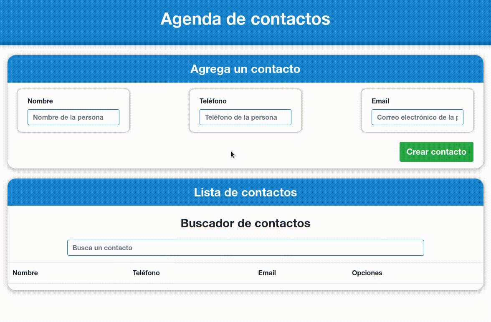
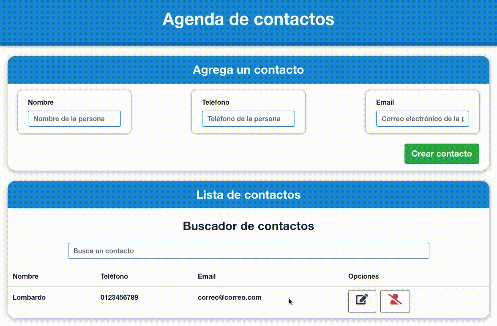
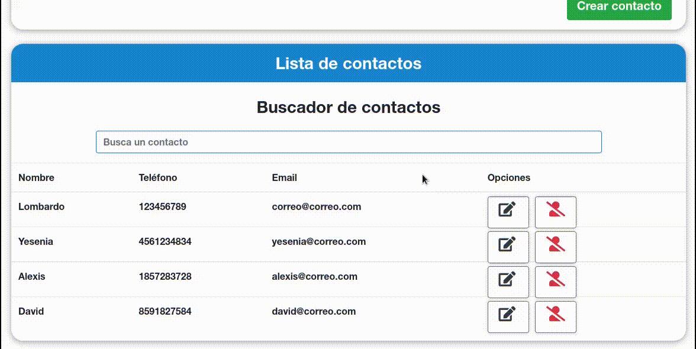
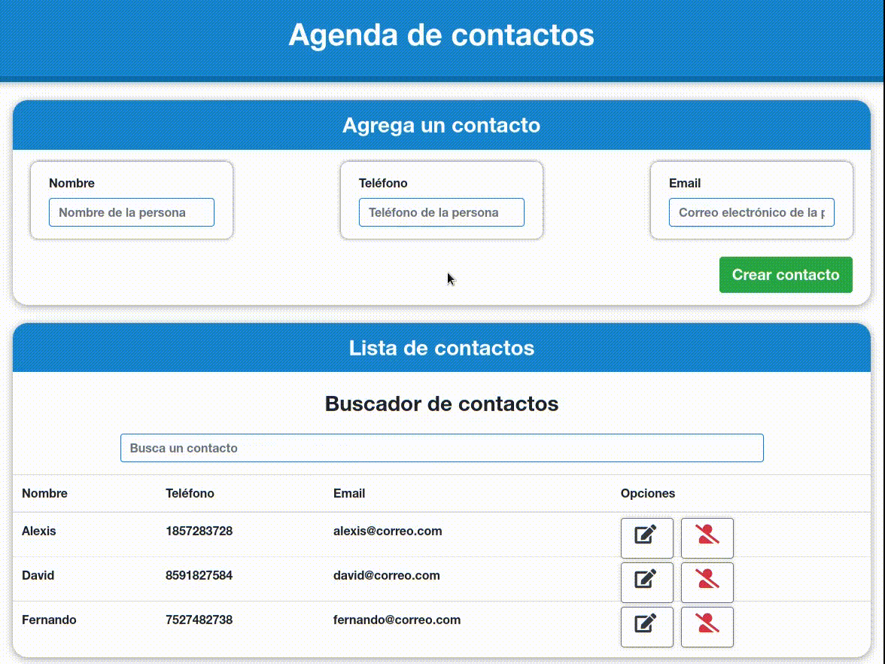

# Agenda
Este proyecto es una agenda de contactos y tiene la capacidad para poder guardar nombres, teléfonos y correos.1<
</br></br>
## ~ Tecnologías usadas para la realización de este proyecto ~
HTML, CSS, Bootstrap, JavaScript, AJAX y PHP
</br></br>
## ¿Cómo instalar el proyecto?
1.- El primer paso es abrir MySQL y crear una base de datos llamada «Agenda».
```
CREATE DATABASE Agenda;
```
2.- Después crear la tabla «Contactos» con los siguientes atributos:
```
CREATE TABLE Contactos (
    ID_Usuario INT AUTO_INCREMENT PRIMARY KEY,
    Nombre VARCHAR(100),
    Telefono BIGINT,
    Email VARCHAR(100)
);
```
3.- Abrir el archivo ```include/conexion.php``` y reemplazar el usuario y contraseña por sus propias credenciales.
4.- Finalmente abrir un servidor local y abrir el proyecto
# Instrucciones de uso
## ~ Creación de contactos ~
Para crear un contacto basta con rellenar los campos de:
- Nombre
- Teléfono
- Email
Una vez rellandos los campos presione el botón de "Crear contacto".
</br></br>

</br></br>
## ~ Edición de contactos ~
Para editar un contacto se debe de seleccionar el botón de editar correspondiente al contacto que se quiere editar.
Será redireccionado a la página de edición de contacto en donde procederá a editar alguno de los siguientes atributos:
- Nombre
- Teléfono
- Email
Después de rellenar los campos presione el botón de "Finalizar edición de contacto".
</br></br>

</br></br></br>
## ~ Búsqueda de contactos ~
Para buscar un contacto primero debe de hacer clic en la barra de búsqueda de contactos y a continuación procederá a escribir el nombre del contacto a buscar
La agenda buscará los contactos relacionados a su búsqueda.
</br></br>

</br></br></br>
## ~ Eliminación de contactos ~
Para eliminar un contacto primero se debe de hacer clic en el botón de eliminar del contacto que se quiere eliminar.
Aparecerá una advertencia para preguntarle si realmente quiere eliminar el contacto
</br></br>

</br></br></br>
# # Autor
Proyecto realizado por: Lombardo Moreno Rodríguez.
